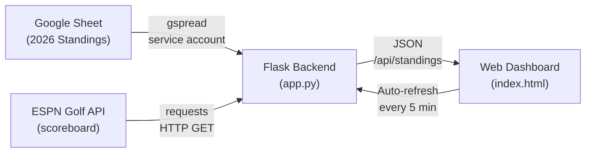
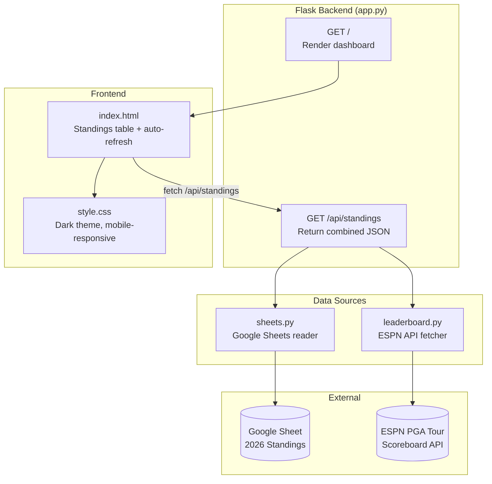
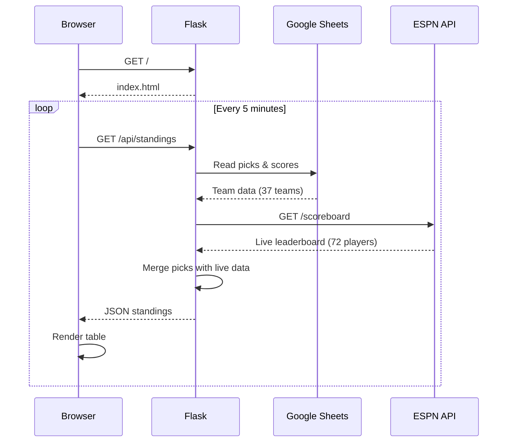

# Raymond Golf Pool — Product Requirements Document

## Overview
A web dashboard for a fantasy golf pool that combines team picks from a Google Sheet with live PGA Tour leaderboard data. Scoring is based on the sum of finishing positions (lowest total wins).

## Problem
Managing a fantasy golf pool via spreadsheet alone requires manual updates and doesn't provide real-time visibility into how teams are performing during an active tournament. Participants have to wait for the sheet to be manually updated to see standings.

## Solution
A lightweight web app that automatically pulls team/pick data from the existing Google Sheet and enriches it with live leaderboard data from ESPN, displaying a real-time standings dashboard.

## Users
- **Pool participants** (~37 teams) — view standings and track their picks during tournaments
- **Pool administrator** — maintains the Google Sheet with picks and final results

## Core Features

### 1. Standings Table
- Ranked list of all teams sorted by total points (lowest first)
- Columns: Rank, Team Name, Total Points, Current Pick, Live Position, Live Score, Thru
- Click a team name to expand and see full pick history across all tournaments

### 2. Google Sheet Integration
- Reads from the "2026 Standings" worksheet
- Parses tournament blocks dynamically (GOLFER / CP / TP column groups)
- Team names pulled from the NAME column (col 13)
- No write access needed — read-only via service account

### 3. Live Leaderboard
- Fetches current PGA Tour tournament data from ESPN's public API
- Shows live position, score relative to par, and holes completed
- Matches golfer names from the sheet to ESPN player names (case-insensitive, full name)
- Incorporates live positions into running point totals for the current week

### 4. Auto-Refresh
- Dashboard refreshes data every 5 minutes via background fetch
- No manual reload required during tournament play
- Timestamp shown for last update

## Data Flow



## Architecture



## Request Sequence



## File Structure

```
~/raymond-golf-app/
├── app.py              # Flask routes — GET / and GET /api/standings
├── sheets.py           # Google Sheets reader (gspread + service account)
├── leaderboard.py      # ESPN PGA Tour API fetcher + parser
├── templates/
│   └── index.html      # Dashboard UI with JS auto-refresh
├── static/
│   └── style.css       # Dark theme, mobile-responsive
├── credentials.json    # Google service account key (gitignored)
├── requirements.txt    # Python dependencies
└── .gitignore
```

### Component Details

#### sheets.py
- Authenticates via Google service account (credentials.json)
- Opens spreadsheet by ID, reads "2026 Standings" worksheet
- Dynamically finds tournament columns by scanning for "GOLFER" in header row
- Returns: `[{team, picks: [{week, tournament, golfer, finish}], total_points}]`

#### leaderboard.py
- Hits ESPN endpoint: `site.api.espn.com/apis/site/v2/sports/golf/pga/scoreboard`
- Parses competitor list: name, order (position), score, linescores
- Returns: `{golfer_name_lower: {name, position, score, today, thru, status, event}}`

#### app.py
- `GET /` — Renders dashboard template with current tournament name
- `GET /api/standings` — Combines sheet data with live leaderboard:
  - Enriches picks with live_position, live_score, live_today, live_thru
  - Recalculates totals using live positions for unfinished tournaments
  - Returns sorted JSON

#### index.html
- Fetches `/api/standings` on load and every 5 minutes
- Renders standings table with conditional styling (under/over par colors)
- Expandable rows show full pick history per team
- Mobile-responsive layout

## Google Sheet Format

```
Row 3:  Tournament names (SONY OPEN, AMERICAN EX, FARMERS, ...)
Row 4:  Column headers (GOLFER, CP, TP repeated per tournament; NAME at col 13)
Row 6+: Data rows

Columns per tournament block:
  GOLFER — Golfer last name (e.g., "MATSUYAMA")
  CP     — Current/final position (e.g., 2)
  TP     — Cumulative total points through that tournament

Col 0:  Team number
Col 13: Team owner name (e.g., "STEVE SARTORIUS")
```

## Scoring
- Each week, a team picks one golfer
- Points = golfer's finishing position (1st place = 1 point, 2nd = 2, etc.)
- Season total = sum of all weekly finishing positions
- **Lowest total wins**

## Tech Stack
- **Backend**: Python 3 + Flask
- **Google Sheets**: gspread + google-auth (service account)
- **Leaderboard**: ESPN public API (no auth required)
- **Frontend**: Vanilla HTML/CSS/JS (no framework)
- **Deployment**: Local (localhost:5001)

## Configuration
| Environment Variable | Purpose                          |
|---------------------|----------------------------------|
| `GOLF_SHEET_ID`     | Google Sheets spreadsheet ID     |
| `GOLF_CREDENTIALS`  | Path to service account JSON (default: credentials.json) |

## Limitations & Known Issues
- Golfer name matching requires full name match (e.g., "MATSUYAMA" won't match "Hideki Matsuyama" on ESPN) — last-name matching can be added later
- No caching — each page load/refresh hits both Google Sheets API and ESPN API
- No authentication on the dashboard — anyone with the URL can view it
- ESPN API is undocumented and could change without notice

## Future Enhancements
- Last-name fuzzy matching for golfer names
- Response caching to reduce API calls
- Historical season-over-season comparison
- Push notifications for position changes
- Deploy to cloud hosting for shared access
