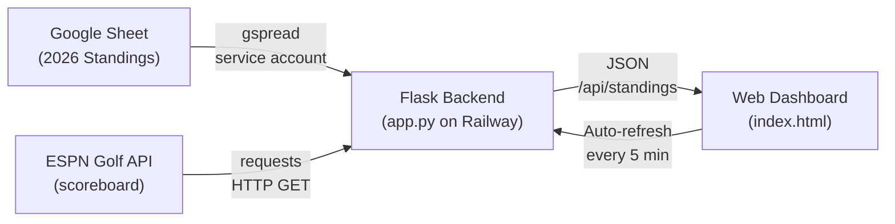
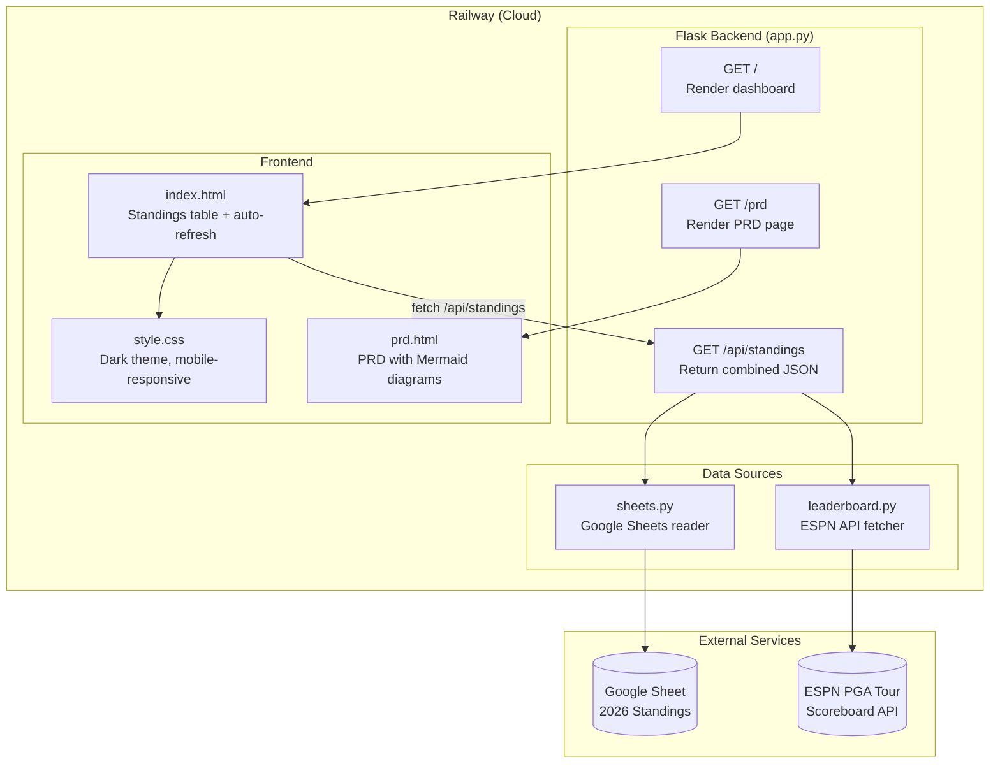
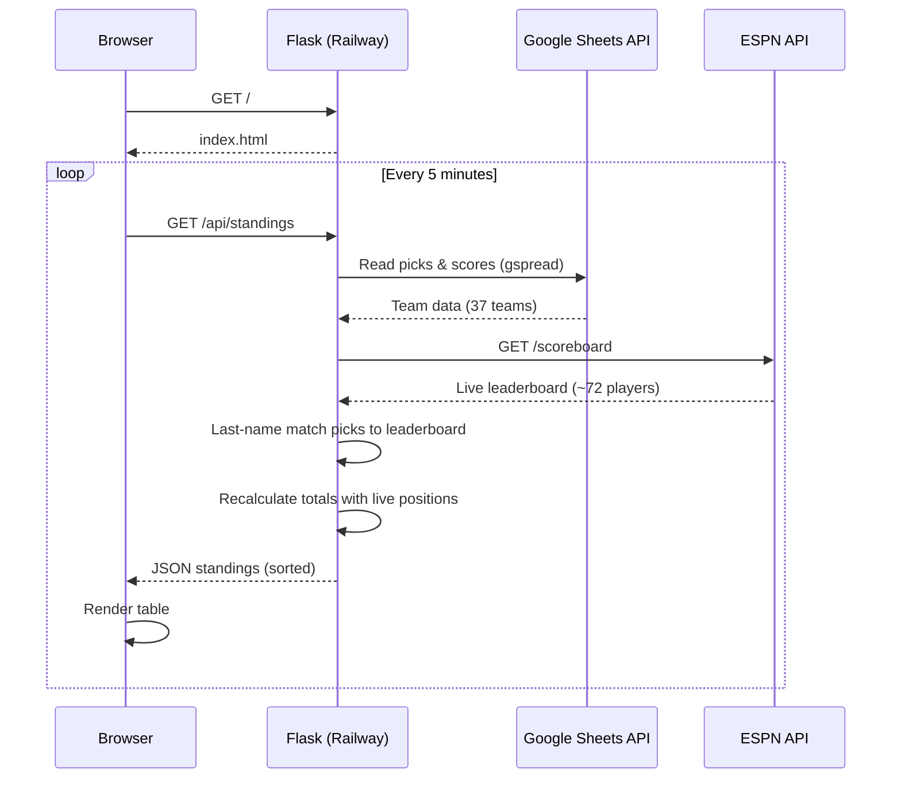

# Raymond Golf Pool — Product Requirements Document

## Overview
A web dashboard for a 37-team fantasy golf pool that combines team picks from a Google Sheet with live PGA Tour leaderboard data from ESPN. Scoring is based on the sum of finishing positions (lowest total wins). The app is deployed on Railway and accessible to all pool participants via a public URL.

**Live URL**: https://raymond-golf-app-production.up.railway.app

## Problem
Managing a fantasy golf pool via spreadsheet alone requires manual updates and doesn't provide real-time visibility into how teams are performing during an active tournament. Participants have to wait for the sheet to be manually updated to see standings.

## Solution
A lightweight web app that automatically pulls team/pick data from the existing Google Sheet and enriches it with live leaderboard data from ESPN, displaying a real-time standings dashboard accessible to anyone with the link.

## Users
- **Pool participants** (~37 teams) — view standings and track their picks during tournaments
- **Pool administrator** — maintains the Google Sheet with picks and final results

## Core Features

### 1. Standings Table
- Ranked list of all teams sorted by total points (lowest first)
- Columns: Rank, Team Name, Total Points, Missed Cuts, Current Pick, Live Position, Score, Thru
- Click a team name to expand and see full pick history across all tournaments with tournament names

### 2. Google Sheet Integration
- Reads from the "2026 Standings" worksheet (gid=1963423056)
- Parses tournament blocks dynamically by scanning for "GOLFER" in the header row
- Team names pulled from the NAME column (col 13)
- Missed cuts tracked via `*` suffix on team names in the sheet
- No write access needed — read-only via Google service account
- Spreadsheet ID: `1NVqaotczmg32TdkszCZCcZNdkvUgpL-uQGfDEX61kNM`

### 3. Live Leaderboard
- Fetches current PGA Tour tournament data from ESPN's public scoreboard API
- Shows live position, score relative to par, and holes completed
- Matches golfer names using last-name matching (sheet uses last names like "MATSUYAMA", ESPN uses full names like "Hideki Matsuyama")
- Incorporates live positions into running point totals for the current week
- Golfers not in the current tournament field won't show live data (expected)

### 4. Auto-Refresh
- Dashboard refreshes data every 5 minutes via JS fetch
- No manual reload required during tournament play
- Timestamp shown for last update

### 5. Missed Cuts Tracking
- Teams with a `*` next to their name in the sheet are flagged as having a missed cut
- MC count displayed in a dedicated column (red text) between Points and Current Pick

## Data Flow



## Architecture



## Request Sequence



## Name Matching Logic

The sheet uses last names only (e.g., "MATSUYAMA", "S W KIM"), while ESPN uses full names (e.g., "Hideki Matsuyama", "Si Woo Kim"). The app builds a last-name lookup from the ESPN data:

1. Try exact full-name match (case-insensitive)
2. Fall back to last-name match — extract the last word from both the sheet pick and each ESPN name
3. Multi-word sheet names like "S W KIM" or "K BRADLEY" match on the last word ("kim", "bradley")

Golfers not in the current tournament field simply won't have live data displayed.

## File Structure

```
~/raymond-golf-app/
├── app.py              # Flask routes — GET /, /api/standings, /prd
├── sheets.py           # Google Sheets reader (gspread + service account)
├── leaderboard.py      # ESPN PGA Tour API fetcher + parser
├── templates/
│   ├── index.html      # Dashboard UI with JS auto-refresh
│   └── prd.html        # PRD page with rendered Mermaid diagrams
├── static/
│   └── style.css       # Dark theme, mobile-responsive styling
├── credentials.json    # Google service account key (in private repo)
├── Dockerfile          # Python 3.11 + gunicorn for Railway
├── .dockerignore       # Excludes venv, __pycache__, .git
├── requirements.txt    # flask, gspread, google-auth, requests
├── PRD.md              # This document
└── .gitignore          # Excludes venv, __pycache__
```

### Component Details

#### sheets.py
- Authenticates via Google service account (`credentials.json` file or `GOOGLE_CREDENTIALS_B64` env var)
- Opens spreadsheet by ID, reads "2026 Standings" worksheet
- Dynamically finds tournament columns by scanning for "GOLFER" in header row (row 4)
- Parses tournament names from row 3 (handles merged cells by scanning backwards)
- Detects missed cuts from `*` suffix on team names in column 13
- Returns: `[{team, picks: [{week, tournament, golfer, finish}], total_points, missed_cuts}]`

#### leaderboard.py
- Hits ESPN endpoint: `site.api.espn.com/apis/site/v2/sports/golf/pga/scoreboard`
- Parses competitor list: name, order (position), score, linescores
- Handles pre-tournament, in-progress, and completed states
- Returns: `{golfer_name_lower: {name, position, score, today, thru, status, event}}`

#### app.py
- `GET /` — Renders dashboard template with current tournament name
- `GET /api/standings` — Combines sheet data with live leaderboard:
  - Builds last-name lookup for matching sheet picks to ESPN names
  - Enriches picks with live_position, live_score, live_today, live_thru
  - Recalculates totals using live positions for unfinished tournaments
  - Returns sorted JSON
- `GET /prd` — Renders the PRD with Mermaid diagrams

#### index.html
- Fetches `/api/standings` on load and every 5 minutes
- Renders standings table with conditional styling (green for under par, red for over par)
- Expandable rows show full pick history per team with tournament names
- Mobile-responsive layout (hides Thru column on small screens)

## Google Sheet Format

```
Sheet: "2026 Standings" (gid=1963423056)

Row 3:  Tournament names (SONY OPEN, AMERICAN EX, FARMERS, PHOENIX OPEN, PEBBLE, GENESIS, ...)
Row 4:  Column headers (GOLFER, CP, TP repeated per tournament; NAME at col 13)
Row 5:  Empty separator row
Row 6+: Data rows

Columns per tournament block:
  GOLFER — Golfer last name (e.g., "MATSUYAMA", "S W KIM")
  CP     — Current/final position (e.g., 2)
  TP     — Cumulative total points through that tournament

Col 0:  Team number (1-37)
Col 13: Team owner name (e.g., "STEVE SARTORIUS", "CHRIS HARLAN*")
        * suffix indicates a missed cut
```

## Scoring
- Each week, a team picks one golfer for that week's PGA Tour event
- Points = golfer's finishing position (1st place = 1 point, 2nd = 2, etc.)
- Season total = sum of all weekly finishing positions
- **Lowest total wins**
- Missed cuts result in a high position number (penalty)

## Tech Stack
- **Backend**: Python 3.11 + Flask (served via gunicorn)
- **Google Sheets**: gspread + google-auth (service account)
- **Leaderboard**: ESPN public API (no auth required)
- **Frontend**: Vanilla HTML/CSS/JS (no framework)
- **Deployment**: Railway (Docker, auto-deploys from GitHub on push)
- **Local dev**: `localhost:5001` with Flask debug mode
- **Source control**: GitHub (private repo: `bcdray/raymond-golf-app`)

## Deployment

### Railway (Production)
- **URL**: https://raymond-golf-app-production.up.railway.app
- **Docker**: Python 3.11-slim + gunicorn, 1 worker, 2 threads
- **Env vars on Railway**: `GOLF_SHEET_ID`, `PORT` (8080)
- **Credentials**: `credentials.json` committed to private GitHub repo
- **Auto-deploy**: Pushes to `main` trigger automatic redeploy

### Local Development
```bash
cd ~/raymond-golf-app
source venv/bin/activate
GOLF_SHEET_ID="1NVqaotczmg32TdkszCZCcZNdkvUgpL-uQGfDEX61kNM" python app.py
# Open http://localhost:5001
```

## Configuration

| Variable | Where | Value |
|----------|-------|-------|
| `GOLF_SHEET_ID` | Railway env var + local env | `1NVqaotczmg32TdkszCZCcZNdkvUgpL-uQGfDEX61kNM` |
| `PORT` | Railway env var | `8080` |
| `GOLF_CREDENTIALS` | Optional, local only | Path to credentials.json (default: `credentials.json`) |
| `GOOGLE_CREDENTIALS_B64` | Optional, env var | Base64-encoded service account JSON |

## Google Cloud Setup
- **Project**: raymond-golf-app (ID: 742376693255)
- **Service account**: `golf-app-leaderboard@raymond-golf-app.iam.gserviceaccount.com`
- **APIs enabled**: Google Sheets API
- **Sheet shared with**: service account email (Viewer access)

## Known Limitations
- No caching — each page load/refresh hits both Google Sheets API and ESPN API
- No authentication on the dashboard — anyone with the URL can view it
- ESPN API is undocumented and could change without notice
- Name matching is last-name only — could have ambiguity if two golfers share a last name (hasn't been an issue so far)
- Golfers not in the current tournament field won't show live data

## Future Enhancements
- Response caching to reduce API calls
- Historical season-over-season comparison
- Push notifications for position changes
- Custom domain name
